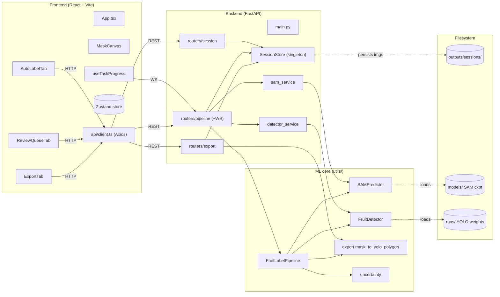
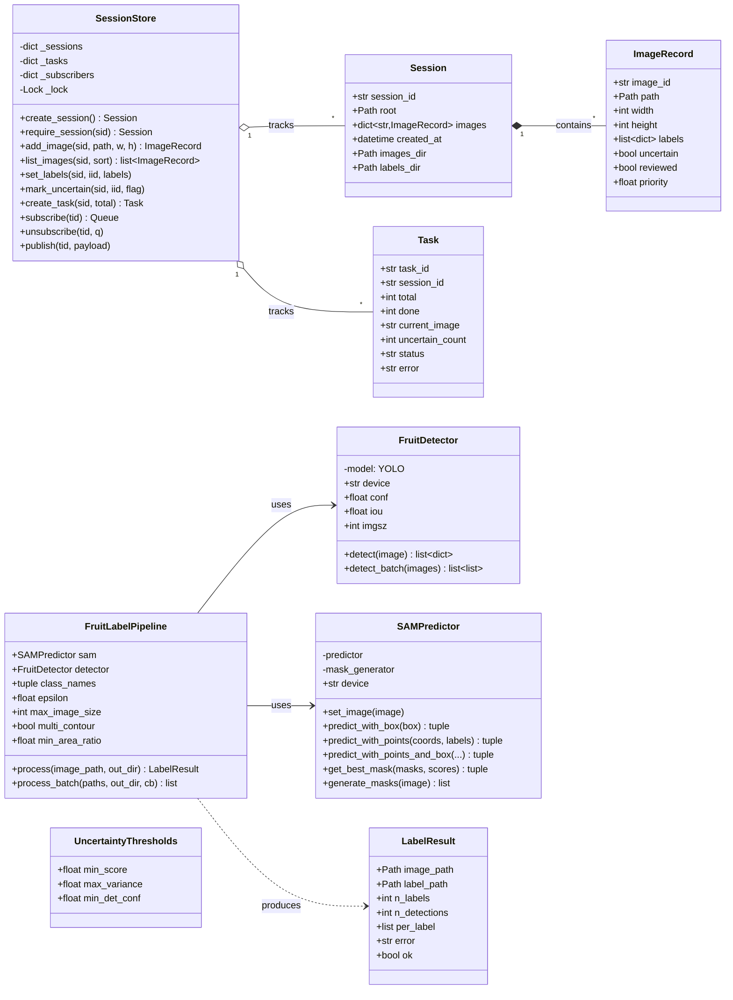
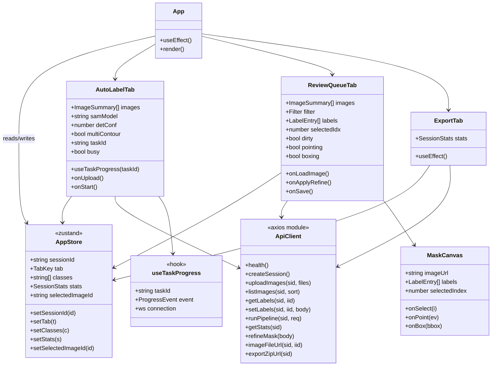
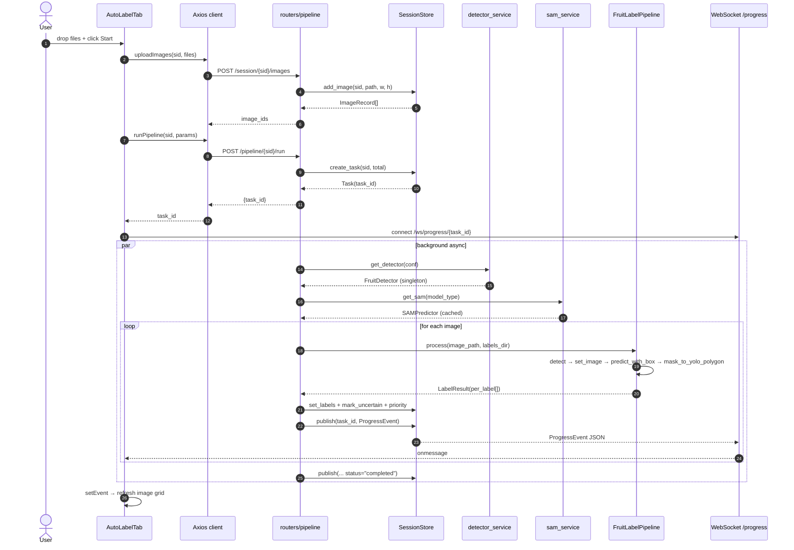
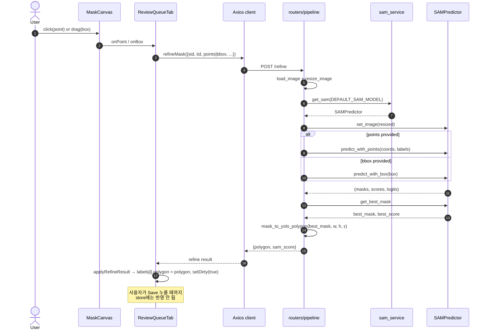
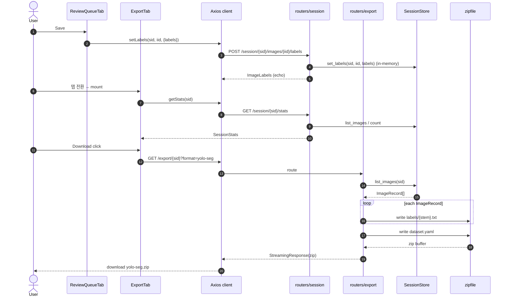
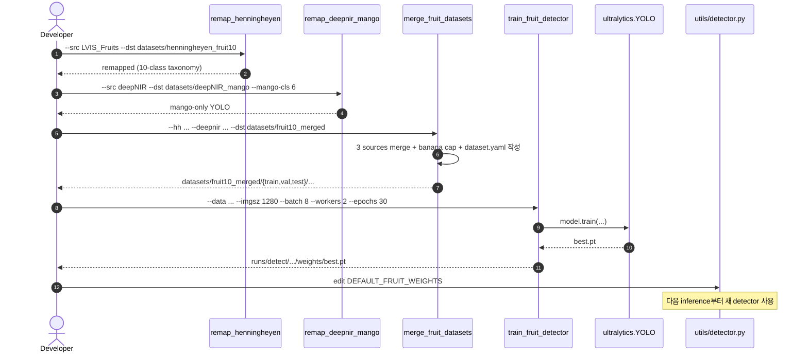
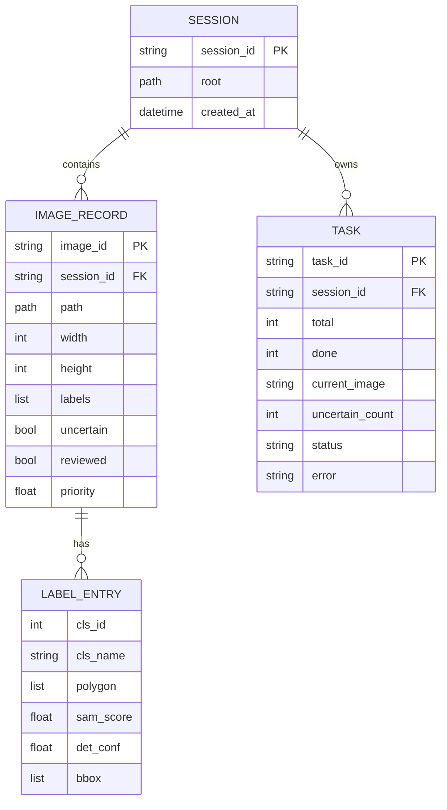
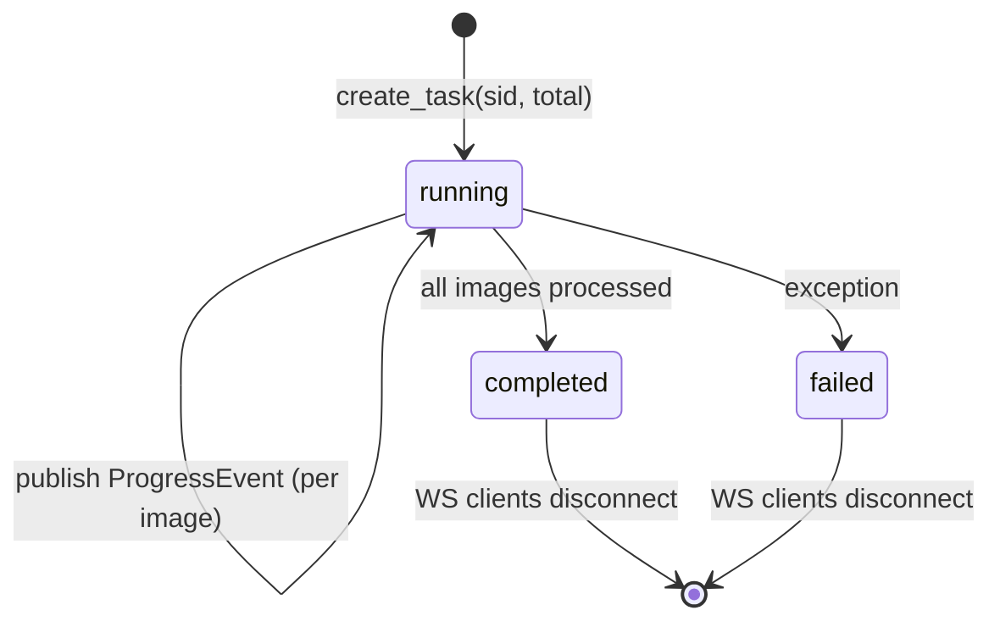
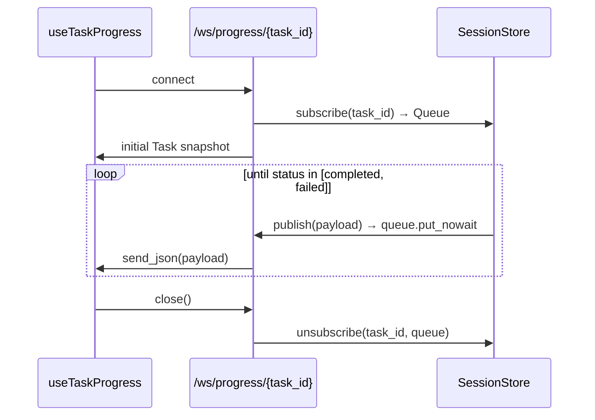

# UML Diagrams

SAM Auto-Label Studio의 클래스/시퀀스/컴포넌트 다이어그램. Mermaid 문법 사용 — GitHub/PyCharm에서 직접 렌더링.

> 시스템 전반 설명은 [`architecture.md`](./architecture.md) 참고.

---

## 1. Component Diagram (System-level)

---

## 2. Class Diagram — Backend

---

## 3. Class Diagram — Frontend (Zustand + Tabs)

---

## 4. Sequence Diagram — Auto-Labeling Pipeline

---

## 5. Sequence Diagram — Refine Mask

---

## 6. Sequence Diagram — Save & Export

---

## 7. Sequence Diagram — Detector Retraining (offline)

---

## 8. Data Model — In-memory Entities

---

## 9. State Machine — Task Lifecycle

---

## 10. WebSocket Channel Lifecycle

